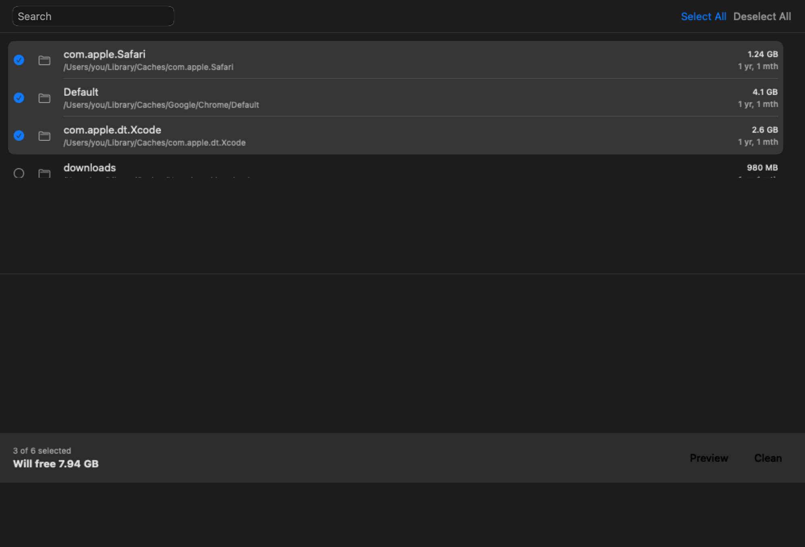
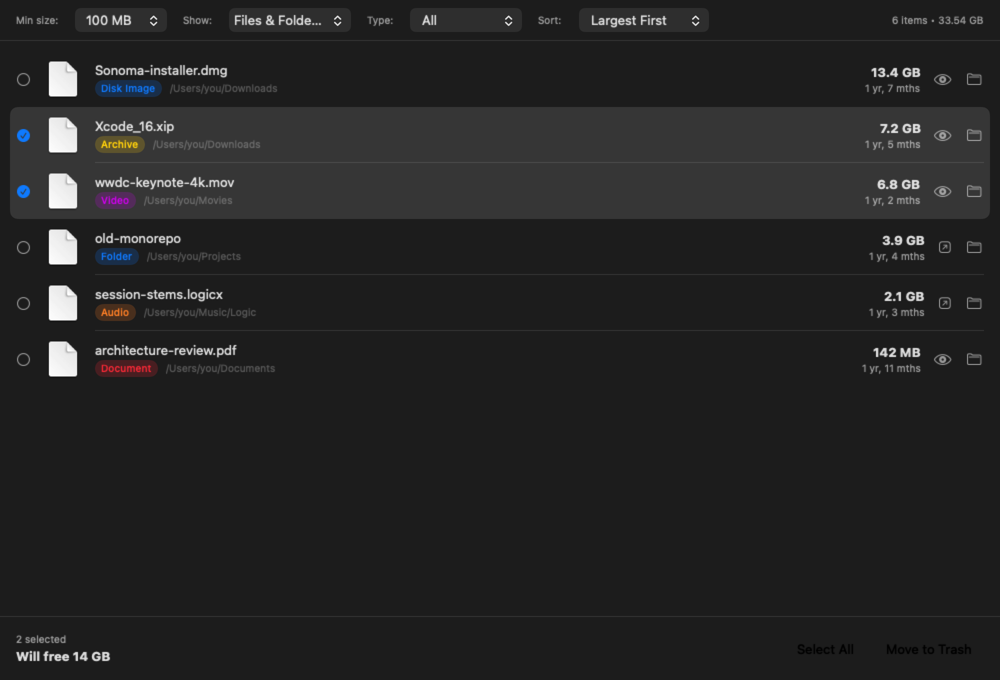
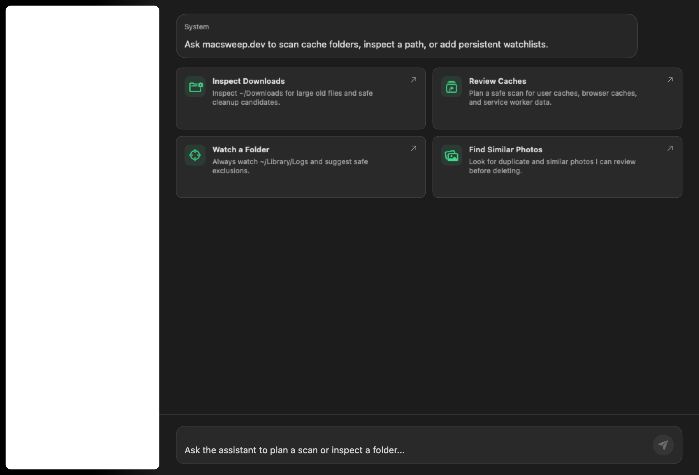
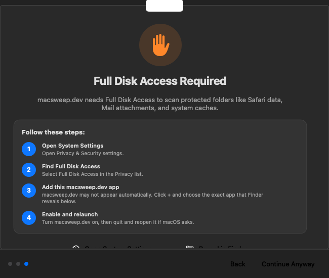

# MacSweep

> [!WARNING]
> This project is under active development and is a work in progress.
> Features may be incomplete, APIs may change, and there may be bugs.
> Contributions and feedback welcome!

[](https://swift.org)
[](https://www.apple.com/macos/)
[](https://opensource.org/licenses/MIT)

A native macOS system cleaner with a SwiftUI app and a Homebrew-installable CLI.
Scan, clean, and optimize your Mac with safety-first defaults.

**Website:** [macsweep.dev](https://macsweep.dev)

## Features

- **Smart Scan** - One-click deep scan for junk files
- **System Cleanup** - Remove caches, logs, and temporary files
- **Browser Cleanup** - Clean browser caches and service workers
- **Developer Tools** - Clean node_modules, DerivedData, Docker, and more
- **AI Assistant** - Use Codex or Claude locally to plan scans and maintain persistent watchlists
- **Large File Finder** - Discover files taking up the most space
- **Space Lens** - Visualize disk usage with an interactive chart
- **App Uninstaller** - Completely remove apps and their leftovers
- **File Shredder** - Securely delete sensitive files
- **Privacy** - Clear browsing history and sensitive data
- **Menu Bar Widget** - Quick access to system stats and actions
- **Real-time Monitoring** - CPU, RAM, disk, battery, and network stats

## Screenshots

### Review before you clean

<p align="center">
  
  
</p>

### AI-assisted analysis

<p align="center">
  
</p>

### Recover protected-folder access

First-run onboarding explains why Full Disk Access is needed and links to the
correct System Settings pane.



## Requirements

- macOS 26.0 (Tahoe) or later
- Homebrew for the recommended CLI install
- Swift 6.2+ / Xcode 26+ command-line tools for building from source
- Full Disk Access permission (for scanning protected folders)

## Installation

Choose the artifact that matches how you want to use MacSweep:

| Install | Includes | Use when |
| --- | --- | --- |
| Homebrew cask | Signed and notarized `MacSweep.app` plus the `macsweep` CLI formula | You want the recommended desktop install with automatic Homebrew upgrades |
| [Latest `MacSweep.dmg`](https://github.com/VincentShipsIt/macsweep/releases/latest/download/MacSweep.dmg) | Signed and notarized native app | You want the GUI without installing the CLI |
| Homebrew formula | Headless `macsweep` CLI only | You use MacSweep from a terminal or automation |
| Source checkout | Local CLI build; Xcode project for the app | You are developing or auditing MacSweep |

### Agent-first install

Paste this into a terminal-capable coding agent to have it install MacSweep for
you:

```text
Install MacSweep on this Mac.

First run these read-only checks:
- Confirm this Mac is running macOS 26.0 Tahoe or later with `sw_vers`.
- Check whether Homebrew is installed with `command -v brew`.
- Check whether Apple's command-line tools can find Swift with `xcrun --find swift`.

If macOS is older than 26.0, stop and explain that MacSweep cannot be installed.
If Homebrew is missing, stop and ask me before installing Homebrew from https://brew.sh.
If Apple's command-line tools are missing, run `xcode-select --install`, then wait for me to finish Apple's installer prompt before continuing.

Then install the stable MacSweep app and CLI:

brew tap vincentshipsit/tap
brew trust --formula vincentshipsit/tap/macsweep
brew install --cask vincentshipsit/tap/macsweep
macsweep version

Do not run any cleanup, delete, apply, shred, uninstall, or maintenance commands.
When the install is done, tell me the installed CLI version, confirm MacSweep.app
is installed, and suggest `macsweep dry-run` as the first safe command.
```

### Homebrew (GUI + CLI, recommended)

MacSweep is distributed from the shared `vincentshipsit/tap`.

For the full desktop install, install the cask. It installs `MacSweep.app` and
pulls in the `macsweep` CLI formula as a dependency:

```bash
brew tap vincentshipsit/tap
brew trust --formula vincentshipsit/tap/macsweep   # required for the CLI formula
brew install --cask vincentshipsit/tap/macsweep     # installs GUI + CLI
```

Verify both entry points:

```bash
open -a MacSweep
macsweep version
```

Want only the headless CLI?

```bash
brew install --formula vincentshipsit/tap/macsweep
```

Prefer the bleeding edge from `master`:

```bash
brew install --formula --HEAD vincentshipsit/tap/macsweep  # CLI only
```

Keep the full desktop install current:

```bash
brew update
brew upgrade --cask vincentshipsit/tap/macsweep
brew upgrade --formula vincentshipsit/tap/macsweep
```

The GUI also checks for signed updates with Sparkle and exposes **MacSweep ›
Check for Updates…**. Sparkle updates the app bundle; the separately packaged CLI
continues to update through Homebrew.

The CLI formula still supports self-update helpers:

```bash
macsweep self-update           # prints the CLI formula upgrade command
macsweep self-update --yes     # upgrades the CLI formula now
```

The first install may take a few minutes because Homebrew compiles the Swift CLI
package locally. If Apple's command-line tools are missing, Homebrew or macOS may
prompt you to install them.

> [!NOTE]
> MacSweep used to be installed from this repo acting as its own tap
> (`vincentshipsit/macsweep`). It now lives in the shared
> [vincentshipsit/tap](https://github.com/VincentShipsIt/homebrew-tap). If you
> tapped the old path, migrate with:
> ```bash
> brew untap vincentshipsit/macsweep
> brew tap vincentshipsit/tap
> ```

### Build from Source

```bash
git clone https://github.com/VincentShipsIt/macsweep.git
cd macsweep/MacSweep
swift build -c release --product macsweep
```

To build the SwiftUI app, open `MacSweep.xcodeproj` in Xcode 26 or later and build
the app target. Local and CI builds use ad-hoc signing without hardened runtime
so the embedded Sparkle framework can load without a Developer ID Team ID. The
release and nightly workflows explicitly restore hardened runtime when signing
with the Developer ID certificate.

### Testing & QA

```bash
zsh scripts/test.sh        # unit suite (swift-testing; works on CLT-only hosts)
zsh scripts/e2e.sh         # CLI e2e safety smoke suite (non-destructive, self-contained fixtures)
zsh scripts/coverage.sh    # unit suite with coverage + safety-critical coverage floors
zsh scripts/render-screenshots.sh   # render every GUI state to scripts/screenshots/ for visual QA
```

CI runs the unit suite with coverage floors and the e2e smoke suite on every
push/PR, renders GUI snapshots as a PR artifact, and repeats e2e + coverage on
a daily schedule (`.github/workflows/nightly.yml`).

### Release signing for app updates

The protected GitHub `release` environment must contain the Developer ID,
notarization, and Sparkle credentials consumed by
`.github/workflows/release.yml`:

- Secrets: `DEVELOPER_ID_P12_BASE64`, `DEVELOPER_ID_P12_PASSWORD`,
  `APPLE_API_PRIVATE_KEY_P8_BASE64`, and `SPARKLE_PRIVATE_ED_KEY`.
- Variables: `APPLE_TEAM_ID`, `APPLE_API_KEY_ID`, `APPLE_API_ISSUER_ID`, and
  `SPARKLE_PUBLIC_ED_KEY`.

The Sparkle-specific values are:

- Variable `SPARKLE_PUBLIC_ED_KEY`: the base64 Ed25519 public key embedded in
  release builds.
- Secret `SPARKLE_PRIVATE_ED_KEY`: the matching base64 private seed exported by
  Sparkle's `generate_keys` tool.

The private key must be backed up outside GitHub and must never be committed.
On every version tag, the release workflow verifies the embedded public key,
signs the notarized app ZIP, generates `appcast.xml`, and publishes both files
to the GitHub release. `scripts/release.sh bump X.Y.Z` advances both the visible
version and Sparkle's bundle build version.

### Nightly app channel

`.github/workflows/nightly-app.yml` publishes a rolling, signed prerelease from
`master`. It uses a separate `nightly` environment because the protected
`release` environment requires approval and would block scheduled builds.

The `nightly` environment must mirror these `release` values:

- Secrets: `DEVELOPER_ID_P12_BASE64`, `DEVELOPER_ID_P12_PASSWORD`,
  `APPLE_API_PRIVATE_KEY_P8_BASE64`, and `SPARKLE_PRIVATE_ED_KEY`.
- Variables: `APPLE_TEAM_ID`, `APPLE_API_KEY_ID`, `APPLE_API_ISSUER_ID`, and
  `SPARKLE_PUBLIC_ED_KEY`.

Nightly intentionally uses the same Sparkle keypair because it is a rolling
prerelease of the same signed app and update trust root, not a separately
installable channel. Its unattended path is constrained by the master-only
environment, protected-branch CI, and GitHub prerelease publication. A future
independent nightly channel must use a separate keypair, embedded public key,
bundle identity, and appcast.

Keep the environment free of required reviewers and restrict its deployment
branch policy to `master`. Verify names and policy without printing secret
values. The final endpoint exists only when the preceding response reports
`deployment_branch_policy.custom_branch_policies: true`; a `404` means the
environment policy is not configured as required.

```bash
gh secret list --repo VincentShipsIt/macsweep.dev --env nightly
gh variable list --repo VincentShipsIt/macsweep.dev --env nightly
gh api repos/VincentShipsIt/macsweep.dev/environments/nightly \
  --jq '{protection_rules, deployment_branch_policy}'
gh api repos/VincentShipsIt/macsweep.dev/environments/nightly/deployment-branch-policies \
  --jq '.branch_policies[] | [.name, .type]'
```

These checks are operator-owned and must be repeated after environment-policy
changes. Do not give the signing workflow an administration token so it can
self-audit GitHub configuration.

Do not move the signing secrets to repository scope as a shortcut: keeping them
in the master-only environment prevents untrusted branches from reading
distribution credentials.

## Safety

MacSweep treats scan results as a proposal, not permission to delete:

- **Dry-run first** - The CLI's `dry-run` command reports the plan without
  deleting. Destructive CLI commands require their explicit command and
  confirmation flags; GUI scans do not clean until you review and confirm.
- **Trash-first for user data** - Review-oriented cleanup such as large files,
  developer artifacts, app bundles and leftovers moves items to Trash for
  recovery. Operations that are inherently irreversible, including secure
  shredding, emptying Trash, privacy clearing, and removal of regenerable cache
  data, say so in their confirmation copy.
- **Protected paths** - Automated cleanup is default-deny and refuses whole
  critical roots such as `~/Documents`, `~/Desktop`, `~/Pictures`, `~/Downloads`,
  credential directories (`~/.ssh`, `~/.gnupg`, `~/.aws`), `/System`,
  `/Applications`, and `~/Applications`. Explicit app removal is narrower:
  a non-symlink `.app` directly inside `/Applications` or `~/Applications` may
  move to Trash after dedicated validation, but removal of either root remains
  blocked. Paths are re-checked immediately before removal.
- **Confirmation and deletion caps** - Operations above 1 GiB require explicit
  confirmation. The cleanup engine blocks a single run above its 10 GiB hard cap.
- **Live preflight checks** - MacSweep re-measures selected paths and applies the
  safety policy at deletion time instead of trusting stale scan metadata.
- **Assistant guardrails** - AI-planned scans use the same safety checks as
  deterministic scans; the assistant cannot bypass confirmation or protected
  paths.

### User ignore and protection rules

The native app and `macsweep` CLI load the same optional files from your home
directory:

- `~/.macsweepignore` omits matching paths from scans and blocks cleanup.
- `~/.macsweepprotect` keeps matching paths visible as review-only findings but
  blocks cleanup.

Each non-comment line is an absolute path, a `~/` path, or a path relative to
your home directory. Plain paths match that path and everything below it. Globs
support `*` within one path component, `**` across directories, and `?` for one
character. A leading `!` makes an exception to an earlier rule in the same file;
the last matching rule wins.

For example, protect source workspaces while allowing known generated artifacts:

```gitignore
# ~/.macsweepprotect
~/www
!~/www/**/node_modules/**
!~/www/**/.build/**
!~/www/**/dist/**
!~/www/**/coverage/**
!~/www/**/.turbo/**
```

Exceptions only cancel user rules. They never override MacSweep's built-in
system, credential, cloud, sensitive-file, symlink, or deletion-cap protections.
If either rule file exists but cannot be read, scans remain available for review
and cleanup fails closed until the file is fixed.

## Full Disk Access

Full Disk Access is optional for launching MacSweep, but protected data sources
such as Safari data, Mail attachments, and some system caches cannot be scanned
completely without it.

1. Open **System Settings → Privacy & Security → Full Disk Access**.
2. Add and enable the exact `MacSweep.app` bundle you installed. If it is not
   listed, use the **+** button and select that bundle wherever it is installed,
   commonly `/Applications` or `~/Applications`.
3. Quit and reopen MacSweep if macOS asks you to relaunch it.
4. Run the scan again. A partial result is not proof that protected folders are
   empty.

Grant Full Disk Access only to the signed app you intended to install. The CLI
reports inaccessible paths rather than treating them as clean.

## Known Limitations and Deferred Work

- MacSweep currently requires macOS 26 Tahoe or later; older macOS releases
  are not supported.
- Results can be partial when macOS denies access, a volume is offline, or an
  external tool such as Docker or Homebrew is unavailable.
- Large files, duplicates, similar photos, uninstaller leftovers, and developer
  project findings require manual review; they are not automatic background
  cleanup.
- The extensions manager, iOS companion, cloud sync, paid licensing, App Store
  distribution, and automatic background deletion are deferred.
- AI analysis is optional and needs a user-supplied provider key. Deterministic
  scanning and safety checks remain available without AI.
## Assistant Config

MacSweep seeds persistent assistant config under:

- `~/Library/Application Support/macsweep.dev/assistant/providers.toml`
- `~/Library/Application Support/macsweep.dev/watchlists/watchlists.toml`
- `~/Library/Application Support/macsweep.dev/watchlists/README.md`

The TOML files are the source of truth for provider defaults and saved watchlists. The markdown file explains the watchlist format and safety boundaries.

## Privacy & Network

MacSweep includes an optional AI Analysis feature that can send directory metadata
(names and sizes, not file contents) to the Anthropic API for intelligent cache
identification. This feature:

- Is **opt-in** — requires you to provide your own API key
- Never sends file contents, only directory names and sizes
- Can be used without AI (deterministic scan works without an API key)
- API key is stored in your macOS Keychain, never in plaintext

## Tech Stack

- **SwiftUI** - Modern declarative UI
- **Combine** - Reactive state management
- **Swift Concurrency** - Async/await for scanning
- **Sparkle 2** - Signed in-app updates for the macOS app

## License

MIT
